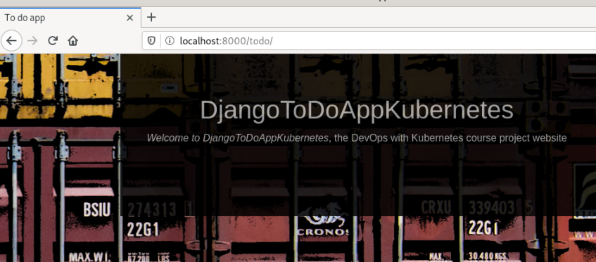
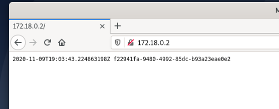

## Part 0

Installing k3d on the Debian 10 server
	
[https://github.com/rancher/k3d]

	su -
	apt install docker.io curl wget vim sudo
	adduser devops
	usermod -aG sudo devops && init 6

	usermod -aG docker devops
	curl -s https://raw.githubusercontent.com/rancher/k3d/main/install.sh | bash
	k3d --version

	k3d version v3.1.5
	k3s version v1.18.9-k3s1 (default)

## Part 1

### Installing kubectl

[https://kubernetes.io/docs/tasks/tools/install-kubectl/]

	curl -LO https://storage.googleapis.com/kubernetes-release/release/v1.18.9/bin/linux/amd64/kubectl
	chmod +x ./kubectl
	sudo mv ./kubectl /usr/local/bin/kubectl
	kubectl version --client

	Client Version: version.Info{Major:"1", Minor:"18", GitVersion:"v1.18.9", GitCommit:"94f372e501c973a7fa9eb40ec9ebd2fe7ca69848", GitTreeState:"clean", BuildDate:"2020-09-16T13:56:40Z", GoVersion:"go1.13.15", Compiler:"gc", Platform:"linux/amd64"}

### k3d

	k3d cluster start
	k3d cluster delete
	
	k3d cluster create --port '8082:30080@agent[0]' -p 8081:80@loadbalancer --agents 2

### kubectl

[https://kubernetes.io/docs/reference/kubectl/docker-cli-to-kubectl/]

	kubectl cluster-info

	kubectl get deployments

	kubectl get pods

	kubectl logs POD_NAME
	
	kubectl describe TYPE NAME
	
Copying secrets between namespaces
	
	kubectl get secret NAME --namespace NAME --export -o yaml | kubectl apply --namespace=NAME -f -

### lens

[https://k8slens.dev/]

	kubectl config view --minify --raw

	sudo snap install kontena-lens --classic

### Services

[https://kubernetes.io/docs/concepts/services-networking/service/]

### ingress

[https://en.wikipedia.org/wiki/OSI_model]

### Exercises

#### 1.01 Getting started

[https://github.com/pasiol/DevOpsWithK8S2020/tree/main/go-main-app]

	docker build ./ -t pasiol/go-main-app:latest
	docker push pasiol/go-main-app:latest
	docker image ls | grep go-main-app
pasiol/go-main-app                                      latest              a1bd3753f6dc        27 minutes ago      1.79MB
	
	docker run pasiol/go-main-app:latest
	2020-11-01T11:14:36.146902677Z 4469fb90-6751-4387-b332-58f6c2de4808
	2020-11-01T11:14:41.147231488Z e7395ff0-3a83-4d34-adba-124f8029b4ca

	kubectl create deployment go-main-app --image=pasiol/go-main-app
	kubectl get deployments
	NAME          READY   UP-TO-DATE   AVAILABLE   AGE
	go-main-app   1/1     1            1           96s

	kubectl get pods
	NAME                           READY   STATUS    RESTARTS   AGE
	go-main-app-676c66fbc6-dxd4s   1/1     Running   0          2m59s

	kubectl logs go-main-app-676c66fbc6-dxd4s
	2020-11-01T11:18:27.635233449Z bccebb61-46cb-4840-a19d-0220b6d37ae5
	2020-11-01T11:18:32.635950697Z dbe17776-eb8b-4dea-888c-2a5b2225b218
	2020-11-01T11:18:37.636461087Z bab6611f-1384-4b6f-995c-6f98627b7689
	2020-11-01T11:18:42.637032246Z ca7022f1-a78f-4bde-b77d-c4bb7acabf73

#### 1.02 Projevt v0.1

Project repo: [https://github.com/pasiol/django-to-do-app]

	kubectl create deployment django-to-do-app --image=pasiol/django-to-do-app:1.02

	devops@devops:~$ kubectl get pods
	NAME                                READY   STATUS              RESTARTS   AGE
	go-main-app-676c66fbc6-dxd4s        1/1     Running             0          98m
	django-to-do-app-5bbb687848-45kh6   0/1     ContainerCreating   0          52s
	devops@devops:~$ kubectl logs django-to-do-app-5bbb687848-45kh6
	Performing system checks...

	System check identified no issues (0 silenced).

	You have 18 unapplied migration(s). Your project may not work properly until you apply the migrations for app(s): admin, auth, contenttypes, sessions.
	Run 'python manage.py migrate' to apply them.
	November 01, 2020 - 12:56:40
	Django version 3.1.2, using settings 'devopsToDoApp.settings'
	Starting development server at http://0.0.0.0:8000/
	Quit the server with CONTROL-C.

#### 1.03 Declarative approach

go-main-app.yaml

	apiVersion: apps/v1
	kind: Deployment
	metadata:
	  name: go-main-app
	spec:
	  replicas: 1
	  selector:
		matchLabels:
		  app: go-main-app
	  template:
		metadata:
		  labels:
			app: go-main-app
		spec:
		  containers:
			- name: go-main-app
			  image: pasiol/go-main-app:latest

cli

	devops@devops:~$ kubectl apply -f go-main-app.yaml 
	deployment.apps/go-main-app created
	devops@devops:~$ kubectl get deployments
	NAME          READY   UP-TO-DATE   AVAILABLE   AGE
	go-main-app   1/1     1            1           21s

#### Exercise 1.04: Project v0.2

django-to-do-app.yaml

	apiVersion: apps/v1
	kind: Deployment
	metadata:
	  name: django-to-do-app
	spec:
	  replicas: 1
	  selector:
		matchLabels:
		  app: django-to-do-app
	  template:
		metadata:
		  labels:
			app: django-to-do-app
		spec:
		  containers:
			- name: django-to-do-app
			  image: pasiol/django-to-do-app:1.02

cli

	kubectl get pods
	NAME                                READY   STATUS              RESTARTS   AGE
	go-main-app-78cbb86cd5-nkj2j        1/1     Running             0          7m56s
	django-to-do-app-5bbb687848-5k26h   0/1     ContainerCreating   0          10s
	devops@devops:~$ kubectl logs django-to-do-app-5bbb687848-5k26h
	Error from server (BadRequest): container "django-to-do-app" in pod "django-to-do-app-5bbb687848-5k26h" is waiting to start: ContainerCreating
	devops@devops:~$ kubectl logs django-to-do-app-5bbb687848-5k26h
	Performing system checks...

	System check identified no issues (0 silenced).

	You have 18 unapplied migration(s). Your project may not work properly until you apply the migrations for app(s): admin, auth, contenttypes, sessions.
	Run 'python manage.py migrate' to apply them.
	November 01, 2020 - 14:23:49
	Django version 3.1.2, using settings 'devopsToDoApp.settings'
	Starting development server at http://0.0.0.0:8000/
	Quit the server with CONTROL-C.
	
#### Exercise 1.05: Project 0.3

cli

	devops@devops:~$ kubectl delete deployment django-to-do-app
	deployment.apps "django-to-do-app" deleted
	devops@devops:~$ kubectl create deployment django-to-do-app --image=pasiol/django-to-do-app:1.05
	deployment.apps/django-to-do-app created
	devops@devops:~$ kubectl get pods
	NAME                                READY   STATUS              RESTARTS   AGE
	go-main-app-78cbb86cd5-nkj2j        1/1     Running             4          7d1h
	django-to-do-app-59d6bccb6f-d8n9l   0/1     ContainerCreating   0          7s
	devops@devops:~$ kubectl port-forward django-to-do-app-59d6bccb6f-d8n9l 8000:8000
	Forwarding from 127.0.0.1:8000 -> 8000
	Forwarding from [::1]:8000 -> 8000

	devops@devops:~$ kubectl logs django-to-do-app-59d6bccb6f-d8n9l
	Performing system checks...

	System check identified no issues (0 silenced).
	November 08, 2020 - 18:10:09
	Django version 3.1.2, using settings 'devopsToDoApp.settings'
	Starting development server at http://0.0.0.0:8000/
	Quit the server with CONTROL-C.
	[08/Nov/2020 18:11:12] "GET /todo/ HTTP/1.1" 200 995
	[08/Nov/2020 18:11:12] "GET /todo/static/css/style.css HTTP/1.1" 200 443
	[08/Nov/2020 18:11:13] "GET /todo/static/css/images/image.jpg HTTP/1.1" 304 0

### Exercise 1.06: Project 0.4

cli:
	
	devops@devops:~$ k3d cluster create --port '8082:30080@agent[0]' -p 8081:80@loadbalancer --agents 2
	INFO[0000] Created network 'k3d-k3s-default' 
	...
	
	devops@devops:~$ kubectl create deployment djangotodoapp --image=pasiol/django-to-do-app:1.05
	deployment.apps/django-to-do-app created

project-service.yaml

	apiVersion: v1
	kind: Service
	metadata:
	  name: django-to-do-svc
	spec:
	  type: NodePort
	  selector:
			  app: django-to-do-app 
	  ports:
			  - nodePort: 30080
				protocol: TCP
				port: 8000
				targetPort: 8000

cli:

	devops@devops:~$ kubectl apply -f project-service.yaml 
	service/django-to-do-svc created

	devops@devops:~$ kubectl describe service django-to-do-svc
	Name:                     django-to-do-svc
	Namespace:                default
	Labels:                   <none>
	Annotations:              Selector:  app=django-to-do-app
	Type:                     NodePort
	IP:                       10.43.164.228
	Port:                     <unset>  8000/TCP
	TargetPort:               8000/TCP
	NodePort:                 <unset>  30080/TCP
	Endpoints:                10.42.1.5:8000
	Session Affinity:         None
	External Traffic Policy:  Cluster
	Events:                   <none>

	devops@devops:~$ kubectl logs django-to-do-app-59d6bccb6f-c5xts
	Performing system checks...

	System check identified no issues (0 silenced).
	November 08, 2020 - 19:37:23
	Django version 3.1.2, using settings 'devopsToDoApp.settings'
	Starting development server at http://0.0.0.0:8000/
	Quit the server with CONTROL-C.
	[08/Nov/2020 19:52:37] "GET /todo/ HTTP/1.1" 200 995
	[08/Nov/2020 19:52:37] "GET /todo/static/css/style.css HTTP/1.1" 200 443
	Not Found: /favicon.ico
	[08/Nov/2020 19:52:37] "GET /favicon.ico HTTP/1.1" 404 2316
	[08/Nov/2020 19:52:37] "GET /todo/static/css/images/image.jpg HTTP/1.1" 200 76076

### Exercise 1.07: External access with Ingress

cli:

	devops@devops:~$ kubectl create deployment go-main-app --image=pasiol/go-main-app:1.07
	deployment.apps/go-main-app created
	devops@devops:~$ kubectl get deployments
	NAME               READY   UP-TO-DATE   AVAILABLE   AGE
	django-to-do-app   1/1     1            1           25h
	go-main-app        0/1     1            0           5s
	devops@devops:~$ kubectl get pods
	NAME                                READY   STATUS    RESTARTS   AGE
	django-to-do-app-59d6bccb6f-c5xts   1/1     Running   0          25h
	go-main-app-ff58ccbc8-2zdqw         1/1     Running   0          46s
	devops@devops:~$ kubectl logs go-main-app-ff58ccbc8-2zdqw
	2020/11/09 18:39:40 Web server main application starting at port 0.0.0.0:3000.

service-go-main-app.yaml:

	apiVersion: v1
	kind: Service
	metadata:
	  name: go-main-app-svc
	spec:
	  type: ClusterIP
	  selector:
		app: go-main-app
	  ports:
		- port: 3333
		  protocol: TCP
		  targetPort: 3000

cli:

	devops@devops:~$ kubectl apply -f service-go-main-app.yaml 
	service/go-main-app-svc created

gma-ingress.yaml

	apiVersion: extensions/v1beta1
	kind: Ingress
	metadata:
	  name: go-main-app-ingress
	spec:
	  rules:
	  - http:
		  paths:
		  - path: /
			backend:
			  serviceName: go-main-app-svc
			  servicePort: 3333

cli:

	devops@devops:~$ kubectl apply -f gma-ingress.yaml 
	ingress.extensions/go-main-app-ingress created
	devops@devops:~$ kubectl get ingress
	NAME                  CLASS    HOSTS   ADDRESS      PORTS   AGE
	go-main-app-ingress   <none>   *       172.18.0.2   80      5s

